# HyperLocalMart — System Design & Sequence Specification

## Version

**2.0** (aligned with PRD v2.3, Security Requirements v1.1)

## Related Documents

| Document | Purpose |
|---|---|
| `01_PRD.md` | Product requirements |
| `03_EVENT_DRIVEN_ARCHITECTURE.md` | Kafka contracts, outbox, DLQ |
| `04_DATABASE_SCHEMA_AND_ERD.md` | Table definitions (*sync next*) |
| `05_API_CONTRACTS.md` | REST API specs (*sync next*) |
| `06_SECURITY_REQUIREMENTS.md` | Security controls |

---

# 1. Design Goals

| Goal | Approach |
|---|---|
| Town isolation | `town_id` on all operational entities; APIs enforce town scope |
| Hub consolidation model | Pickup leg + hub receipt + last-mile leg with agent mapping |
| Buyer simplicity | One master order externally; sub-orders internal only |
| No inventory counters | Listing `active/inactive` only; no stock decrement |
| Scale to 300 towns | OpenSearch, Redis, Kafka, CDN, DB sharding path |
| Reliability | Outbox pattern, idempotent consumers, `Idempotency-Key` on writes |
| Auditability | Immutable town history; SLA timestamps on every order |

---

# 2. Architecture Principles

1. **Database per service** — no cross-service DB access.
2. **REST for queries/commands** from clients via API Gateway.
3. **Kafka for business events** — choreography (no orchestrator in MVP).
4. **Town-scoped authorization** on every hub/vendor operational API.
5. **Correlation ID** propagated: Gateway → services → Kafka → logs.
6. **Events are immutable**; state changes drive new events.
7. **Fail closed on auth** — invalid token or wrong town → 403.

## 2.1 Loose coupling (mandatory)

HyperLocalMart is a **loosely coupled** microservice platform. Convenience must not collapse service boundaries.

| Rule | Requirement |
|---|---|
| Data ownership | Each service owns its PostgreSQL schema; no cross-DB reads/writes |
| API boundaries | Peers integrate via versioned REST internal APIs or Kafka contracts |
| No entity leakage | JPA entities stay inside a service; DTOs/records cross boundaries |
| Async side effects | Notifications, search indexing, reporting → events, not blocking HTTP |
| Single writer | One service owns each aggregate (Order, Payment, Listing, Assignment) |
| Idempotency | Writes that can retry (checkout, webhooks, consumers) use keys or dedup tables |
| Gateway scope | Public clients use gateway routes only; `/internal/**` stays private |

**Acceptable sync HTTP (pilot):** cart pricing, checkout validation, hub dashboard stats enrichment — short request/response with timeouts and DTOs.

**Move to Kafka next:** order placed, payment captured, sub-order ready, delivered — replace fire-and-forget HTTP where possible.

**Anti-patterns:** shared tables, importing another service's entities, long synchronous chains, exposing internal URLs on the gateway, failing checkout when a non-critical notifier is down.

## 2.2 UI loose coupling (Flutter + React)

Client apps must stay **wireframe-resilient** — new designs should not force API or domain rewrites.

| Layer | Responsibility | Changes when wireframes update |
|---|---|---|
| **Presentation** | Layout, components, navigation shell | Often |
| **State** | Hooks, BLoC, controllers, form flow | Sometimes |
| **Data** | API clients, repositories, DTO → view model mappers | Rarely |

**Rules**

1. Screens/widgets **never** call HTTP directly — use repositories typed against `05_API_CONTRACTS.md`.
2. Map API DTOs to **view models** before rendering; do not bind UI to raw JSON field names in templates.
3. **Design tokens** (theme) for color, spacing, typography — no per-screen magic values.
4. **Presentational components** are prop-driven; business rules live in state layer or backend.
5. Organize by **feature domain** (`cart`, `orders`, `vendor/listings`), not by one-off wireframe filenames.
6. Extract **loading / error / empty** states as shared components.
7. Keep **routing** in a single module so screen order can change without moving logic.

**Target folder shape (when apps are built)**

```text
apps/buyer/  or  web/vendor-portal/
  features/<domain>/
    data/       # api client, repository, mappers
    state/      # hooks / bloc / store
    ui/         # screens + presentational widgets
  shared/       # theme tokens, generic components, routing
```

Project rule: `.cursor/rules/loose-coupling.mdc`

---

# 3. High-Level Architecture

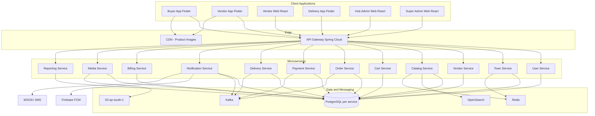

---

# 4. Client Applications

| App | Users | Phase 1 |
|---|---|---|
| **Buyer** (Flutter) | Buyers | Android |
| **Vendor** (Flutter + React web) | Vendors | Both |
| **Delivery** (Flutter + React web) | Hub admin, delivery agents | Both |
| **Super Admin** (React web) | Platform super admins | Web |

Hub admin uses **Delivery web** for assignments, dashboards, COD close; **Delivery mobile** for hub receipt and field coordination. Agents use **Delivery mobile** only.

---

# 5. Monorepo Layout

Single git repository (ARCH1):

```
hyperlocalmart/
├── pom.xml                          # Maven parent
├── docker-compose.yml
├── libs/
│   └── common-core/                 # Events, security, outbox, idempotency, DTOs
├── gateway/
│   └── api-gateway/
├── services/
│   ├── user-service/
│   ├── town-service/
│   ├── vendor-service/
│   ├── catalog-service/
│   ├── cart-service/
│   ├── order-service/
│   ├── payment-service/
│   ├── delivery-service/
│   ├── notification-service/
│   ├── billing-service/
│   ├── media-service/
│   └── reporting-service/           # Phase 1 SLA dashboards; analytics Phase 2
├── apps/
│   ├── buyer-app/                   # Flutter
│   ├── vendor-app/
│   └── delivery-app/
├── web/
│   ├── vendor-portal/               # React
│   ├── delivery-portal/
│   └── super-admin/
└── infra/
    ├── k8s/                         # Production manifests
    └── terraform/                   # Optional IaC
```

Package root: `com.hyperlocalmart`

---

# 6. Microservices Catalog

| Service | Port (dev) | Database | Primary responsibilities |
|---|---|---|---|
| **api-gateway** | 8080 | — | JWT validation, routing, rate limit, correlation ID |
| **user-service** | 8081 | `hyperlocalmart_user` | Auth, buyers, roles, addresses, device tokens |
| **town-service** | 8082 | `hyperlocalmart_town` | Towns, config, feature flags, status labels, town history |
| **vendor-service** | 8083 | `hyperlocalmart_vendor` | Vendor registration requests, shops, approval state |
| **catalog-service** | 8084 | `hyperlocalmart_catalog` | Master catalog, vendor listings, catalog requests |
| **cart-service** | 8085 | `hyperlocalmart_cart` | Cart, town-change rules |
| **order-service** | 8086 | `hyperlocalmart_order` | Master orders, sub-orders, status machine, SLA timestamps |
| **payment-service** | 8087 | `hyperlocalmart_payment` | Razorpay/PhonePe, COD, refunds, settlements |
| **delivery-service** | 8088 | `hyperlocalmart_delivery` | Hubs, agents, assignments, pickup/delivery legs |
| **notification-service** | 8089 | `hyperlocalmart_notification` | SMS, push, templates, quiet hours |
| **billing-service** | 8090 | `hyperlocalmart_billing` | Fee rules, commission calc, slabs, invoices |
| **media-service** | 8091 | `hyperlocalmart_media` | S3 upload, signed URLs, malware scan metadata |
| **reporting-service** | 8092 | `hyperlocalmart_reporting` | Real-time dashboards, SLA reports, exports |

**Phase 1 merge option:** `billing-service` logic may live inside `town-service` + `payment-service` initially; `reporting-service` may start as read models in `order-service` until split.

---

# 7. Service Ownership

## User Service

* Users, credentials (BCrypt), roles (`BUYER`, `VENDOR`, `HUB_ADMIN`, `DELIVERY_AGENT`, `SUPER_ADMIN`)
* Buyer profile, saved addresses
* FCM device tokens
* JWT issuance and refresh token store (hashed)
* Same phone → multiple roles allowed

## Town Service

* Town master (`name`, `state`, `code` e.g. NRPT/AP, pincode reference, ~10km coverage flag)
* Town enable/disable
* Per-town config (min order, SLA hours, quiet hours, SMS caps, refund days, feature flags)
* Buyer-visible status label mapping
* **Town history** (immutable audit append-only, 3-year retention)
* Super admin on-behalf session tracking

## Vendor Service

* Vendor registration **requests** (hub admin creates; super admin approves)
* Shop profile, GST/bank (encrypted fields), shop image refs
* Vendor active/inactive
* Does **not** store platform fee terms visible to hub admin

## Catalog Service

* Master categories and items (super admin)
* Unit config table
* Vendor listings (price, discount, active flag, vendor note)
* Catalog add requests (vendor → super admin approval)
* **OpenSearch** index sync for buyer search by item name
* No inventory quantity

## Cart Service

* Cart per buyer + `town_id`
* Cart line snapshots (listing id, price at add time)
* Town change → clear cart (gateway/cart rule)
* Validates town enabled and min order at checkout handoff

## Order Service

* Master order + vendor sub-orders + line items
* Order number generation: `{TOWN}/{STATE}-{DDMMYY}-O{SEQ}`
* Status state machines (master + sub-order)
* SLA timestamps: `placed_at`, `picked_from_vendor_at`, `brought_to_hub_at`, `delivered_at`
* Vendor reject → publish cancel + refund trigger
* Outbox → Kafka
* `Idempotency-Key` on create order

## Payment Service

* Payment initiation (UPI/GPay/PhonePe/QR via Razorpay + PhonePe)
* COD marker on order
* Webhook verification (signed)
* Refunds (full master order); configurable working days
* Weekly settlement records (vendor + hub)
* COD daily reconciliation entries
* Wallet tables reserved for Phase 2

## Delivery Service

* One delivery hub per town
* Delivery agents (multi-hub link table)
* Assignments: `PICKUP` (per sub-order), `LAST_MILE` (per master order)
* Agent status active/inactive
* Pickup verification, hub receipt confirmation (hub admin API), OTP delivery
* Offline-sync friendly assignment APIs for mobile

## Notification Service

* Consumes Kafka events → fans out SMS (MSG91) + FCM push
* Template management (super admin)
* Quiet hours per town
* SMS cap per order per town
* WhatsApp adapter stub for Phase 2

## Billing Service

* Town fee configuration (vendor, hub, buyer slabs)
* Commission engine (all scenarios from PRD T2)
* Fee version tagging on orders (for report clarity when rules change)
* E-invoice / GST line generation data for PDF service
* Default: no commission on vendor-reject cancel

## Media Service

* Upload to S3 private bucket
* Malware/content-type validation, EXIF strip
* Signed URL generation (15–60 min TTL)
* Photo metadata linked to order/sub-order/stage
* 90-day retention job
* Audit log on photo view (hub admin, super admin)

## Reporting Service

* Real-time dashboards (orders/min, GMV, hub SLA)
* Per-town and super-admin views
* SLA: ready-for-pickup overdue, hub wait, delivery time
* Bulk export (orders, COD, payouts) — Phase 1
* Analytics Kafka consumer — Phase 2

---

# 8. Town Scoping Model

Every operational record carries `town_id` (UUID).

| Actor | Scope rule |
|---|---|
| Super admin | All towns; optional on-behalf hub session |
| Hub admin | `town_id` from hub registration only |
| Vendor | `town_id` from vendor registration |
| Agent | Orders assigned in linked hubs |
| Buyer | Selected `town_id` for browse/cart; delivery address must match |

**Gateway:** JWT contains `roles[]` and optional `town_ids[]` / `vendor_id` / `agent_id`. Downstream services **re-validate** — never trust client-sent town alone.

---

# 9. Communication Patterns

## 9.1 Synchronous (REST)

| Use case | Pattern |
|---|---|
| Buyer browse/search | Gateway → Catalog (OpenSearch) |
| Login / refresh | Gateway → User |
| Place order | Gateway → Order (+ sync Payment initiate) |
| Hub assign agent | Gateway → Delivery |
| Super admin config | Gateway → Town / Billing |

**Internal service calls:** prefer **events**; use sync REST only when immediate response required (e.g. Cart → Catalog price validation at checkout).

## 9.2 Asynchronous (Kafka)

Choreography — each service reacts to events:

```
order.payment_requested → Payment
payment.success         → Order, Notification, Delivery (notify hub)
vendor.sub_order.ready  → Notification
vendor.sub_order.reject → Order → payment.refund_requested
assignment.created      → Notification → Agent push
order.delivered         → Notification, Reporting
```

See `03_EVENT_DRIVEN_ARCHITECTURE.md` for topic list; **v2 additions below**.

## 9.3 Kafka Topics (v2 additions)

| Topic | Producer | Consumers |
|---|---|---|
| `hyperlocalmart.order.placed` | order-service | notification, reporting |
| `hyperlocalmart.order.cancelled` | order-service | payment, notification, reporting |
| `hyperlocalmart.payment.success` | payment-service | order, notification, reporting |
| `hyperlocalmart.payment.failed` | payment-service | order, notification |
| `hyperlocalmart.payment.refund_requested` | order-service | payment-service |
| `hyperlocalmart.payment.refunded` | payment-service | notification, reporting |
| `hyperlocalmart.vendor_sub_order.ready` | order-service | notification |
| `hyperlocalmart.vendor_sub_order.rejected` | order-service | order, payment, notification |
| `hyperlocalmart.sub_order.picked` | delivery-service | order, notification, reporting |
| `hyperlocalmart.sub_order.at_hub` | delivery-service | order, notification, reporting |
| `hyperlocalmart.order.ready_for_delivery` | order-service | notification |
| `hyperlocalmart.assignment.pickup` | delivery-service | notification |
| `hyperlocalmart.assignment.last_mile` | delivery-service | notification |
| `hyperlocalmart.order.out_for_delivery` | delivery-service | notification |
| `hyperlocalmart.order.delivered` | delivery-service | payment (COD reconcile), notification, billing, reporting |
| `hyperlocalmart.order.buyer_rejected` | delivery-service | notification, reporting |
| `hyperlocalmart.hub.cod_reconciled` | payment-service | reporting, town-history |

**Partition key:** `orderId` (master order UUID) for ordering guarantees.

---

# 10. API Gateway Design

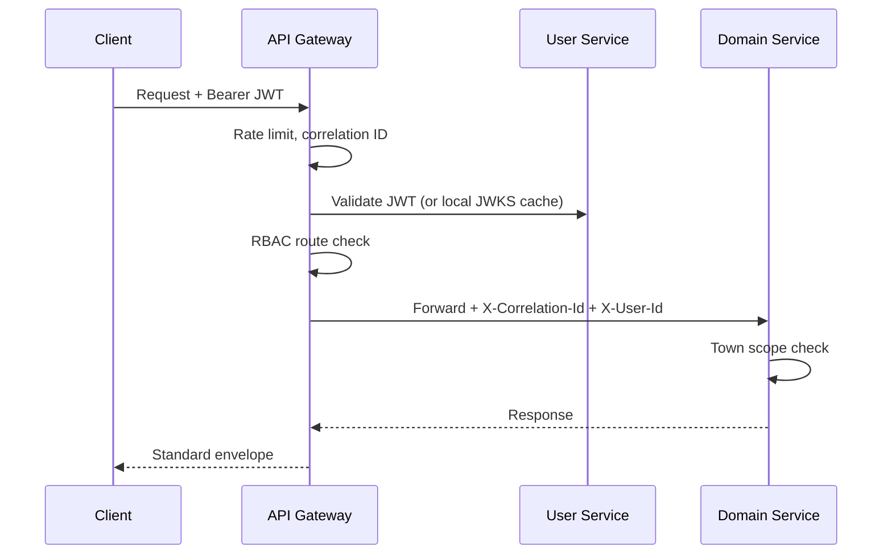

| Responsibility | Detail |
|---|---|
| Auth | JWT validation; public routes: register, login, guest catalog browse |
| Rate limiting | Per IP + per user; 10k req/min platform capacity |
| Headers | `X-Correlation-Id`, `X-Request-Id`, `Idempotency-Key` forwarded |
| Routing | `/api/v1/users/**` → user-service, etc. |
| CORS | Strict allowlist for web portals |

---

# 11. Core Sequence Flows

## 11.1 Guest Browse & Search

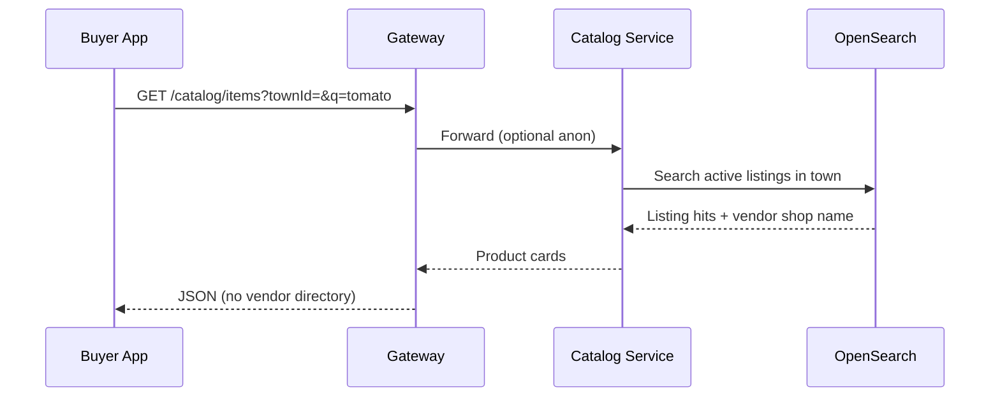

* Redis cache hot queries per `town_id + query hash`.
* CDN serves master product images.

---

## 11.2 Place Order (Online Payment)

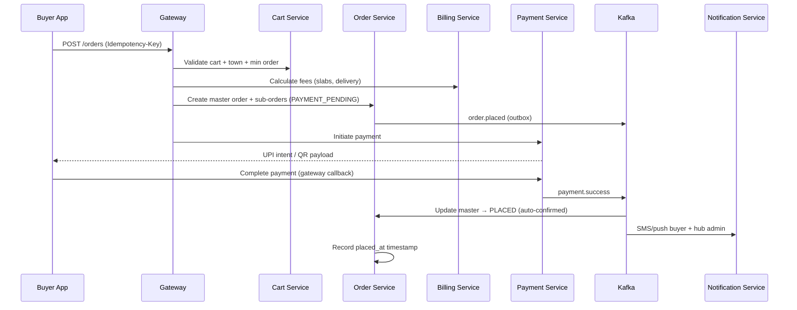

**Payment failed:** `payment.failed` → order `PAYMENT_FAILED`; cart retained; buyer retries `POST /orders/{id}/payments/retry`.

**COD:** skip gateway; order `PLACED` immediately; COD amount on bill.

---

## 11.3 Vendor Sub-Order Lifecycle

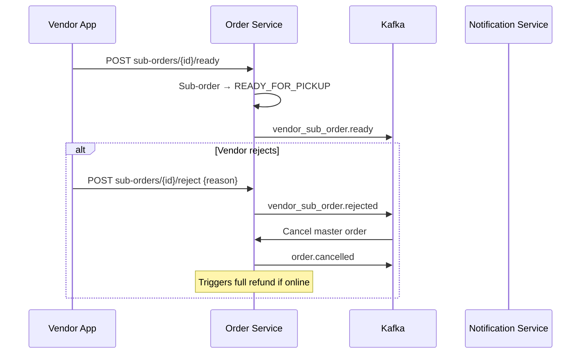

**Scheduler (order-service):** if not ready within town config hours → alert hub admin + super admin (no auto-cancel).

---

## 11.4 Pickup Leg (Agent → Vendor → Hub)

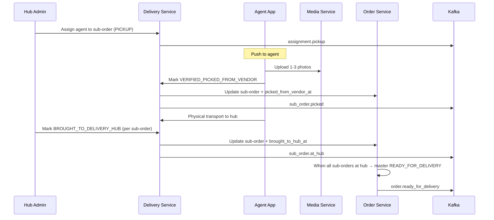

---

## 11.5 Last-Mile Delivery

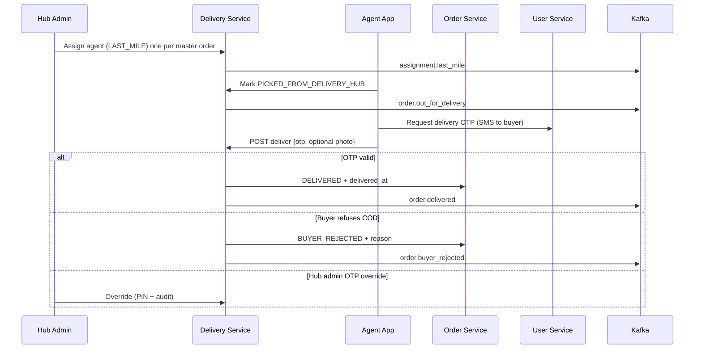

---

## 11.6 Vendor Reject → Refund

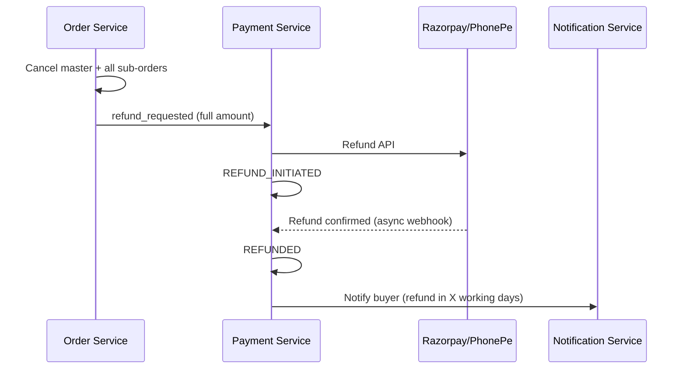

---

## 11.7 COD Daily Reconciliation

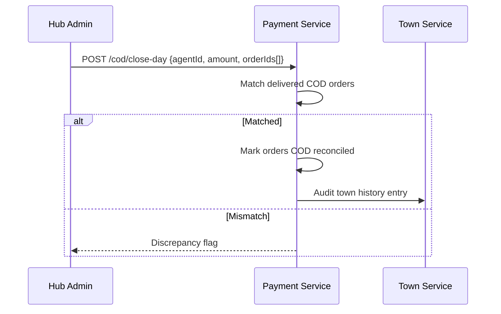

---

# 12. State Machines

## 12.1 Master Order

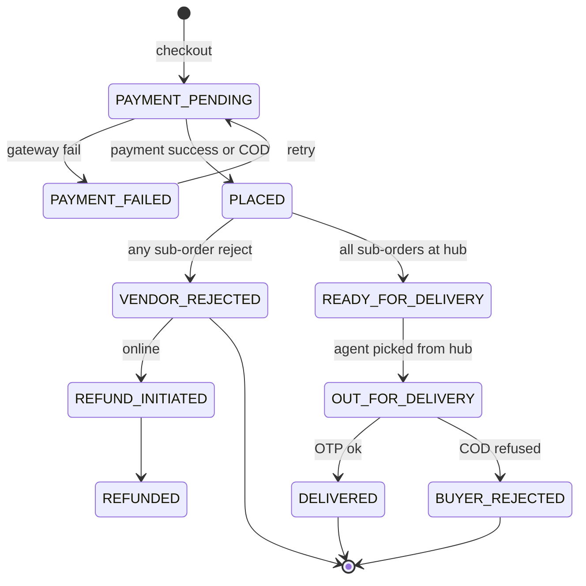

Buyer-visible labels mapped via Town Service config (super admin).

## 12.2 Vendor Sub-Order

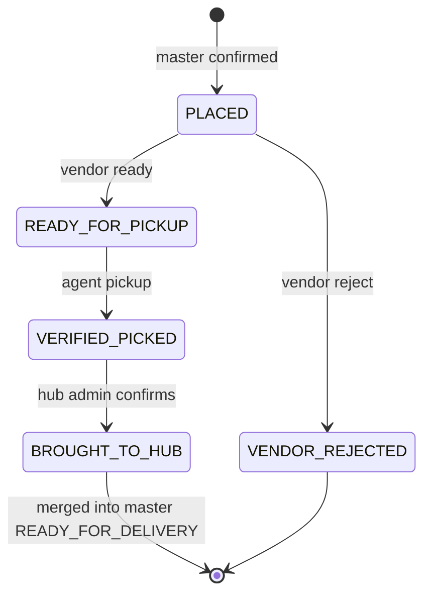

---

# 13. Agent Assignment Model

```
Master Order NRPT/AP-250626-O0001
│
├── Sub-Order A ── PICKUP assignment → Agent Ravi
├── Sub-Order B ── PICKUP assignment → Agent Ravi (same or different)
└── Sub-Order C ── PICKUP assignment → Agent Suresh
│
└── LAST_MILE assignment → Agent Suresh (one agent per master order)
```

| Table | Purpose |
|---|---|
| `delivery_assignments` | `id`, `order_id`, `vendor_sub_order_id` (nullable for last mile), `agent_id`, `leg_type` (PICKUP/LAST_MILE), `status`, timestamps |
| `agent_hub_links` | `agent_id`, `hub_id`, `town_id`, `active` |

Inactive agent: no new assignments; hub admin may reassign in-flight work.

---

# 14. Caching Strategy (Redis)

| Key pattern | TTL | Purpose |
|---|---|---|
| `town:config:{townId}` | 5 min | Town config, feature flags |
| `catalog:search:{townId}:{hash}` | 2 min | Search result page |
| `catalog:listing:{id}` | 5 min | Hot listing detail |
| `user:session:{userId}` | 1 h | Optional session metadata |
| `idempotency:{key}` | 24 h | Duplicate POST protection |

Invalidate on listing price update, town disable, config change.

---

# 15. Search (OpenSearch)

* Index: `vendor_listings` (town_id, item name, category, price, vendor shop name, active)
* Sync: Catalog service on listing create/update/delete (Kafka internal or direct)
* Buyer search: item name only; results grouped by listing (shows shop name on card)
* Target: sub-200ms search p95 in town

---

# 16. Media Pipeline

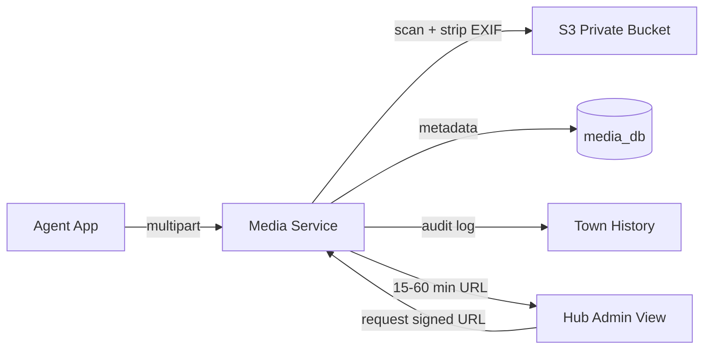

---

# 17. Billing & Settlement (Weekly)

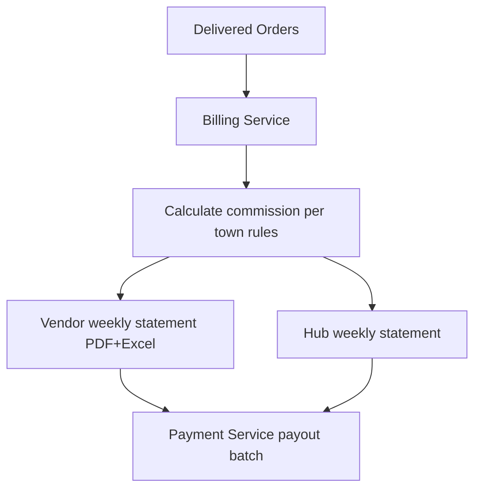

* Fee rule version stamped on each order for reporting (T8).
* Platform fee visible to vendor **only on payout statement**.

---

# 18. Notification Fan-Out

Notification service consumes Kafka → applies:

1. Channel enabled? (super admin)
2. Quiet hours? (town config)
3. SMS cap for order? (town config)
4. Template render (super admin editable)
5. Dispatch MSG91 / FCM

Phase 2: WhatsApp adapter.

---

# 19. Security Architecture

| Layer | Control |
|---|---|
| Edge | HTTPS, WAF, rate limits |
| Gateway | JWT, RBAC, correlation ID |
| Services | Town scope, IDOR checks, field encryption (GST/bank) |
| Hub admin | PIN for disable vendor, COD close |
| Super admin | 2FA (SMS + authenticator), on-behalf audit |
| Mobile | Keystore tokens, Play Integrity (Delivery app), Android 8+ |
| Payments | Webhook signatures, idempotency, no card data |
| Audit | Immutable town history 3 years; photo view logged |

Full detail: `06_SECURITY_REQUIREMENTS.md`

---

# 20. Observability

| Signal | Tool |
|---|---|
| Health | `/actuator/health` per service |
| Metrics | Prometheus + Micrometer |
| Logs | Structured JSON; correlationId, eventId |
| Dashboards | Grafana — orders/min, payment failures, consumer lag, p95 latency |
| Alerts | Login spikes, DLQ growth, error rate, Kafka lag |

**SLA metrics (reporting-service):**

* `order_placed → picked_from_vendor`
* `picked → brought_to_hub`
* `ready_for_delivery → delivered`
* Ready-for-pickup overdue count

---

# 21. Deployment Architecture

## 21.1 Local Development (Docker Compose)

| Container | Image / Notes |
|---|---|
| postgres × 12 | One per service (or shared instance, separate DBs in dev) |
| redis | Cache |
| kafka + zookeeper | Events |
| opensearch | Search |
| minio (optional) | S3-compatible local; prod uses AWS S3 |
| kafka-ui | Dev debugging |
| All services | Built from monorepo |

## 21.2 Production Path

| Stage | Strategy |
|---|---|
| Pilot (Narsaraopet) | Single region ap-south-1, rolling deploy |
| 24+ towns | Blue/green via K8s |
| Scale | HPA on gateway, catalog, order; Kafka partitions 6+; read replicas |

**Support window:** platform on-call 10 AM – 5 PM IST; automated alerts 24/7.

---

# 22. Idempotency & Consistency

| Operation | Mechanism |
|---|---|
| Create order | `Idempotency-Key` + Redis + DB unique constraint |
| Create payment | `Idempotency-Key` + gateway idempotency |
| Kafka consume | `processed_events` table per consumer |
| Event publish | Transactional outbox + scheduler |
| Order state change | Optimistic locking on `version` column |

---

# 23. Cross-Service Data References

Services store **foreign references as UUIDs only** (no FK across DBs):

| Field | Stored in | Refers to |
|---|---|---|
| `town_id` | Most services | town-service |
| `buyer_id` | order, cart, payment | user-service |
| `vendor_id` | catalog listing, sub-order | vendor-service |
| `listing_id` | cart, order line | catalog-service |
| `hub_id`, `agent_id` | delivery, assignments | delivery-service |

Enrichment at read time via sync API or cached read models — never cross-DB join.

---

# 24. Phase 1 Service Boundaries (Narsaraopet)

**Must have running:**

* Gateway, User, Town, Vendor, Catalog, Cart, Order, Payment, Delivery, Notification, Media, Billing (or merged), Reporting (dashboards)

**Can be modules first, extract later:**

* Billing → town + payment
* Reporting → order read models
* Media → delivery module

**Explicitly Phase 2:**

* Analytics Kafka consumer / data warehouse
* Buyer wallet
* WhatsApp notifications
* Google Maps
* iOS apps

---

# 25. Future Enhancements

* GPS tracking (delivery-service + mobile background)
* Buyer wallet (payment-service tables reserved)
* Partial fulfillment / cancellation policies
* ONDC integration
* DB shard by `town_id` on order + catalog
* Multi-region DR (Mumbai + Bangalore)

---

# Revision History

| Version | Date | Changes |
|---|---|---|
| 1.0 | — | Initial multi-vendor design |
| 2.0 | 2026-06-24 | Full alignment with PRD v2.3: town/hub/agent model, OpenSearch, no inventory, state machines, assignments, COD reconcile, billing, media, reporting, monorepo, security |

This document defines how all services interact and how business flows operate within HyperLocalMart.
