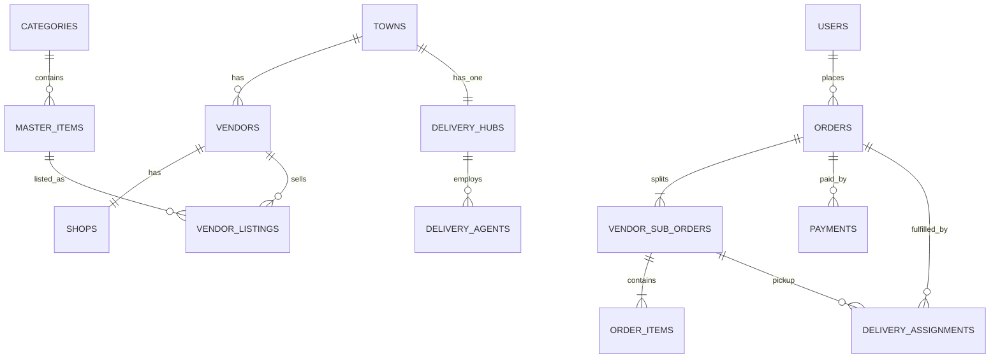
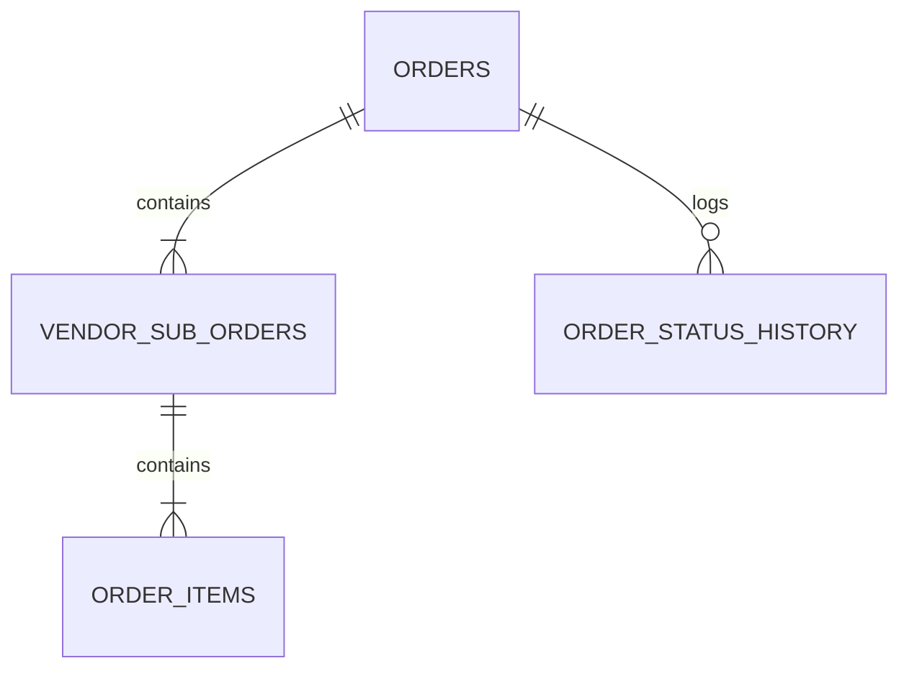
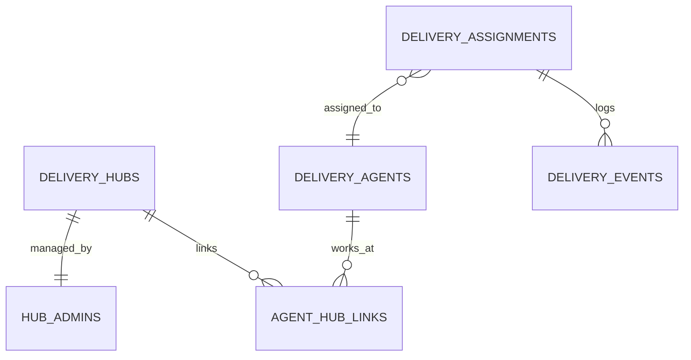

# HyperLocalMart — Database Schema & ERD

## Version

**2.0** (aligned with PRD v2.3, System Design v2.0)

## Database Engines

* **PostgreSQL 16+** per microservice
* **OpenSearch** — search index (catalog-service owned; not relational schema here)
* **Redis** — cache (no durable schema)

---

# 1. Design Principles

1. **One database per microservice** — no cross-service foreign keys.
2. **UUID primary keys** (`gen_random_uuid()` via PostgreSQL `pgcrypto` or app-generated UUID v4).
3. **Audit columns** on mutable business tables: `created_at`, `updated_at`, `created_by`, `updated_by` (UUID of acting user).
4. **Foreign keys only inside the same database.**
5. **Cross-service references** stored as UUID (+ optional denormalized snapshot fields on orders).
6. **Soft delete** where applicable (`deleted_at`); audit/history tables are **append-only** (no delete).
7. **Money** as `DECIMAL(12,2)`; currency `INR` assumed (column optional if multi-currency later).
8. **Timestamps** in `TIMESTAMPTZ` (UTC stored, IST displayed).
9. **Optimistic locking** on hot rows (`version INTEGER NOT NULL DEFAULT 0`).
10. **PII / sensitive fields** — `gst_number`, `bank_account`, `ifsc` stored encrypted at application layer; DB may use `BYTEA` or `TEXT` ciphertext.

### Standard Audit Columns

```sql
created_at   TIMESTAMPTZ NOT NULL DEFAULT NOW()
updated_at   TIMESTAMPTZ NOT NULL DEFAULT NOW()
created_by   UUID
updated_by   UUID
```

---

# 2. Database Inventory

| Database | Service | Phase |
|---|---|---|
| `hyperlocalmart_user` | user-service | 1 |
| `hyperlocalmart_town` | town-service | 1 |
| `hyperlocalmart_vendor` | vendor-service | 1 |
| `hyperlocalmart_catalog` | catalog-service | 1 |
| `hyperlocalmart_cart` | cart-service | 1 |
| `hyperlocalmart_order` | order-service | 1 |
| `hyperlocalmart_payment` | payment-service | 1 |
| `hyperlocalmart_delivery` | delivery-service | 1 |
| `hyperlocalmart_notification` | notification-service | 1 |
| `hyperlocalmart_billing` | billing-service | 1 (may merge into town/payment initially) |
| `hyperlocalmart_media` | media-service | 1 |
| `hyperlocalmart_reporting` | reporting-service | 1 (read models; may start in order DB) |

---

# 3. User Service — `hyperlocalmart_user`

## `users`

| Column | Type | Constraints |
|---|---|---|
| id | UUID | PK |
| phone | VARCHAR(15) | NOT NULL, UNIQUE (+91) |
| email | VARCHAR(255) | UNIQUE, NULL |
| password_hash | VARCHAR(255) | NOT NULL |
| first_name | VARCHAR(100) | |
| last_name | VARCHAR(100) | |
| status | VARCHAR(30) | NOT NULL — `ACTIVE`, `LOCKED`, `DISABLED` |
| failed_login_count | INT | DEFAULT 0 |
| locked_until | TIMESTAMPTZ | |
| last_login_at | TIMESTAMPTZ | |
| + audit | | |

**Indexes:** `phone`, `email`, `status`

---

## `roles`

| Column | Type | Constraints |
|---|---|---|
| id | UUID | PK |
| name | VARCHAR(50) | UNIQUE — `BUYER`, `VENDOR`, `HUB_ADMIN`, `DELIVERY_AGENT`, `SUPER_ADMIN` |
| description | VARCHAR(255) | |
| + audit | | |

---

## `user_roles`

| Column | Type | Constraints |
|---|---|---|
| id | UUID | PK |
| user_id | UUID | FK → users, NOT NULL |
| role_id | UUID | FK → roles, NOT NULL |
| town_id | UUID | NULL — scope hub/vendor to town when applicable |
| vendor_id | UUID | NULL — denorm ref when role=VENDOR |
| hub_id | UUID | NULL — denorm ref when role=HUB_ADMIN |
| agent_id | UUID | NULL — denorm ref when role=DELIVERY_AGENT |
| created_at | TIMESTAMPTZ | |

**Unique:** `(user_id, role_id, town_id, vendor_id, hub_id, agent_id)` — simplified: `(user_id, role_id, COALESCE(town_id,...))` via app logic

**Indexes:** `user_id`, `role_id`, `town_id`

---

## `refresh_tokens`

| Column | Type | Constraints |
|---|---|---|
| id | UUID | PK |
| user_id | UUID | FK → users, NOT NULL |
| token_hash | VARCHAR(255) | NOT NULL |
| expires_at | TIMESTAMPTZ | NOT NULL |
| revoked_at | TIMESTAMPTZ | |
| replaced_by | UUID | NULL — rotation chain |
| created_at | TIMESTAMPTZ | |

**Indexes:** `user_id`, `token_hash`, `expires_at`

---

## `addresses`

| Column | Type | Constraints |
|---|---|---|
| id | UUID | PK |
| user_id | UUID | FK → users, NOT NULL |
| town_id | UUID | NOT NULL — cross-service ref |
| label | VARCHAR(50) | e.g. Home |
| recipient_name | VARCHAR(100) | NOT NULL |
| recipient_phone | VARCHAR(15) | NOT NULL |
| line1 | VARCHAR(255) | NOT NULL |
| line2 | VARCHAR(255) | |
| landmark | VARCHAR(255) | |
| pincode | VARCHAR(10) | |
| is_default | BOOLEAN | DEFAULT false |
| + audit | | |

**Indexes:** `user_id`, `town_id`

---

## `device_tokens`

| Column | Type | Constraints |
|---|---|---|
| id | UUID | PK |
| user_id | UUID | FK → users |
| platform | VARCHAR(20) | `ANDROID`, `IOS`, `WEB` |
| fcm_token | VARCHAR(512) | NOT NULL |
| app_type | VARCHAR(30) | `BUYER`, `VENDOR`, `DELIVERY` |
| last_used_at | TIMESTAMPTZ | |
| + audit | | |

**Indexes:** `user_id`, `fcm_token`

---

## `user_blocks`

| Column | Type | Constraints |
|---|---|---|
| id | UUID | PK |
| user_id | UUID | NOT NULL — blocked buyer |
| town_id | UUID | NULL — town-scoped block or global if NULL |
| reason | TEXT | |
| blocked_by | UUID | NOT NULL |
| blocked_at | TIMESTAMPTZ | NOT NULL |
| unblocked_at | TIMESTAMPTZ | |

**Indexes:** `user_id`, `town_id`

---

## `idempotency_records`

| Column | Type | Constraints |
|---|---|---|
| id | UUID | PK |
| idempotency_key | VARCHAR(128) | UNIQUE NOT NULL |
| user_id | UUID | |
| resource_type | VARCHAR(50) | e.g. `REGISTER` |
| resource_id | UUID | |
| response_snapshot | JSONB | |
| expires_at | TIMESTAMPTZ | |

---

# 4. Town Service — `hyperlocalmart_town`

## `towns`

| Column | Type | Constraints |
|---|---|---|
| id | UUID | PK |
| name | VARCHAR(150) | NOT NULL |
| state | VARCHAR(100) | NOT NULL |
| town_code | VARCHAR(10) | NOT NULL — e.g. `NRPT` |
| state_code | VARCHAR(10) | NOT NULL — e.g. `AP` |
| display_name | VARCHAR(200) | NOT NULL — `Narsaraopet (Andhra Pradesh)` |
| coverage_radius_km | DECIMAL(5,2) | DEFAULT 10.00 |
| status | VARCHAR(30) | `ENABLED`, `DISABLED` |
| + audit | | |

**Unique:** `(name, state)`, `(town_code, state_code)`

**Indexes:** `status`, `state`

---

## `town_pincodes`

| Column | Type | Constraints |
|---|---|---|
| id | UUID | PK |
| town_id | UUID | FK → towns, NOT NULL |
| pincode | VARCHAR(10) | NOT NULL |
| + audit | | |

**Unique:** `(town_id, pincode)`

---

## `town_config`

Key-value config per town (flexible knobs from PRD T1).

| Column | Type | Constraints |
|---|---|---|
| id | UUID | PK |
| town_id | UUID | FK → towns, NOT NULL |
| config_key | VARCHAR(100) | NOT NULL |
| config_value | JSONB | NOT NULL |
| effective_from | TIMESTAMPTZ | NOT NULL DEFAULT NOW() |
| effective_to | TIMESTAMPTZ | |
| + audit | | |

**Examples of `config_key`:** `min_order_value`, `ready_for_pickup_alert_hours`, `refund_working_days`, `max_sms_per_order`, `quiet_hours`, `delivery_sla_hours_options`, `maintenance_window`

**Unique:** `(town_id, config_key, effective_from)`

**Indexes:** `town_id`, `config_key`

---

## `order_status_labels`

| Column | Type | Constraints |
|---|---|---|
| id | UUID | PK |
| town_id | UUID | NULL — NULL = platform default |
| internal_code | VARCHAR(60) | NOT NULL |
| display_label | VARCHAR(100) | NOT NULL |
| visible_to_buyer | BOOLEAN | DEFAULT true |
| sort_order | INT | |
| + audit | | |

**Unique:** `(town_id, internal_code)`

---

## `town_history`

Immutable audit log (append-only).

| Column | Type | Constraints |
|---|---|---|
| id | UUID | PK |
| town_id | UUID | NOT NULL |
| actor_user_id | UUID | NOT NULL |
| actor_role | VARCHAR(50) | |
| on_behalf_of_hub_id | UUID | NULL |
| action | VARCHAR(100) | NOT NULL |
| entity_type | VARCHAR(100) | |
| entity_id | UUID | |
| before_snapshot | JSONB | |
| after_snapshot | JSONB | |
| correlation_id | UUID | |
| ip_address | VARCHAR(45) | |
| created_at | TIMESTAMPTZ | NOT NULL DEFAULT NOW() |

**Indexes:** `town_id`, `created_at`, `actor_user_id`, `action`

---

## `on_behalf_sessions`

| Column | Type | Constraints |
|---|---|---|
| id | UUID | PK |
| super_admin_user_id | UUID | NOT NULL |
| hub_id | UUID | NOT NULL |
| town_id | UUID | NOT NULL |
| started_at | TIMESTAMPTZ | NOT NULL |
| expires_at | TIMESTAMPTZ | NOT NULL |
| ended_at | TIMESTAMPTZ | |

---

## `platform_settings`

Global super-admin settings (notification channels, etc.).

| Column | Type | Constraints |
|---|---|---|
| id | UUID | PK |
| setting_key | VARCHAR(100) | UNIQUE NOT NULL |
| setting_value | JSONB | NOT NULL |
| + audit | | |

---

# 5. Vendor Service — `hyperlocalmart_vendor`

## `vendor_registration_requests`

| Column | Type | Constraints |
|---|---|---|
| id | UUID | PK |
| town_id | UUID | NOT NULL |
| requested_by | UUID | NOT NULL — hub admin or super admin user id |
| business_name | VARCHAR(255) | NOT NULL |
| owner_name | VARCHAR(255) | |
| phone | VARCHAR(15) | NOT NULL |
| shop_name | VARCHAR(255) | NOT NULL |
| address | TEXT | |
| gst_number_enc | TEXT | encrypted |
| bank_account_enc | TEXT | encrypted |
| ifsc_enc | TEXT | encrypted |
| shop_image_media_id | UUID | |
| gst_cert_media_id | UUID | |
| status | VARCHAR(30) | `PENDING`, `APPROVED`, `REJECTED` |
| reviewed_by | UUID | super admin |
| reviewed_at | TIMESTAMPTZ | |
| reject_reason | TEXT | |
| vendor_id | UUID | set on approval |
| + audit | | |

**Indexes:** `town_id`, `status`, `phone`

---

## `vendors`

| Column | Type | Constraints |
|---|---|---|
| id | UUID | PK |
| town_id | UUID | NOT NULL |
| user_id | UUID | NOT NULL — login account |
| registration_request_id | UUID | FK → vendor_registration_requests |
| business_name | VARCHAR(255) | NOT NULL |
| owner_name | VARCHAR(255) | |
| phone | VARCHAR(15) | NOT NULL |
| gst_number_enc | TEXT | |
| bank_account_enc | TEXT | |
| ifsc_enc | TEXT | |
| status | VARCHAR(30) | `ACTIVE`, `INACTIVE`, `DISABLED` |
| disabled_by | UUID | |
| disabled_reason | TEXT | |
| + audit | | |

**Indexes:** `town_id`, `user_id`, `phone`, `status`

---

## `shops`

| Column | Type | Constraints |
|---|---|---|
| id | UUID | PK |
| vendor_id | UUID | FK → vendors, NOT NULL |
| shop_name | VARCHAR(255) | NOT NULL |
| address | TEXT | |
| pincode | VARCHAR(10) | |
| latitude | DECIMAL(10,8) | |
| longitude | DECIMAL(11,8) | |
| closed_days_note | TEXT | |
| shop_image_media_id | UUID | |
| status | VARCHAR(30) | `ACTIVE`, `INACTIVE` |
| + audit | | |

**Indexes:** `vendor_id`

---

# 6. Catalog Service — `hyperlocalmart_catalog`

**No inventory tables.** Availability = `vendor_listings.active = true`.

## `units`

| Column | Type | Constraints |
|---|---|---|
| id | UUID | PK |
| code | VARCHAR(20) | UNIQUE — `KG`, `PIECE`, `LITRE` |
| label | VARCHAR(50) | NOT NULL |
| status | VARCHAR(30) | `ACTIVE`, `INACTIVE` |
| + audit | | |

---

## `categories`

| Column | Type | Constraints |
|---|---|---|
| id | UUID | PK |
| name | VARCHAR(100) | NOT NULL |
| description | TEXT | |
| image_media_id | UUID | |
| status | VARCHAR(30) | `ACTIVE`, `INACTIVE` |
| + audit | | |

---

## `master_items`

| Column | Type | Constraints |
|---|---|---|
| id | UUID | PK |
| category_id | UUID | FK → categories, NOT NULL |
| name | VARCHAR(255) | NOT NULL |
| description | TEXT | |
| unit_id | UUID | FK → units, NOT NULL |
| mrp | DECIMAL(12,2) | reference |
| image_media_id | UUID | |
| status | VARCHAR(30) | `ACTIVE`, `INACTIVE` |
| + audit | | |

**Indexes:** `category_id`, `name`, `status`

---

## `vendor_listings`

| Column | Type | Constraints |
|---|---|---|
| id | UUID | PK |
| town_id | UUID | NOT NULL |
| vendor_id | UUID | NOT NULL |
| shop_id | UUID | NOT NULL |
| master_item_id | UUID | FK → master_items, NOT NULL |
| price | DECIMAL(12,2) | NOT NULL |
| discount_price | DECIMAL(12,2) | |
| vendor_note | VARCHAR(500) | optional short description |
| active | BOOLEAN | NOT NULL DEFAULT true |
| price_updated_at | TIMESTAMPTZ | |
| + audit | | |

**Unique:** `(vendor_id, master_item_id)` — one listing per item per vendor

**Indexes:** `town_id`, `vendor_id`, `master_item_id`, `active`, `(town_id, active)`

---

## `catalog_requests`

Vendor requests new category/item (super admin approves).

| Column | Type | Constraints |
|---|---|---|
| id | UUID | PK |
| town_id | UUID | NOT NULL |
| vendor_id | UUID | NOT NULL |
| request_type | VARCHAR(30) | `NEW_ITEM`, `NEW_CATEGORY` |
| category_id | UUID | NULL — existing or proposed |
| proposed_name | VARCHAR(255) | NOT NULL |
| proposed_unit_id | UUID | |
| description | TEXT | |
| notes | TEXT | |
| reference_media_id | UUID | |
| status | VARCHAR(30) | `PENDING`, `APPROVED`, `REJECTED` |
| reviewed_by | UUID | |
| reviewed_at | TIMESTAMPTZ | |
| master_item_id | UUID | set on approval |
| + audit | | |

**Indexes:** `vendor_id`, `status`, `town_id`

---

## `listing_price_history`

For reorder price-change alerts.

| Column | Type | Constraints |
|---|---|---|
| id | UUID | PK |
| listing_id | UUID | FK → vendor_listings |
| price | DECIMAL(12,2) | |
| discount_price | DECIMAL(12,2) | |
| recorded_at | TIMESTAMPTZ | NOT NULL |

**Indexes:** `listing_id`, `recorded_at`

---

# 7. Cart Service — `hyperlocalmart_cart`

## `carts`

| Column | Type | Constraints |
|---|---|---|
| id | UUID | PK |
| user_id | UUID | NOT NULL |
| town_id | UUID | NOT NULL |
| status | VARCHAR(30) | `ACTIVE`, `CONVERTED`, `ABANDONED` |
| + audit | | |

**Unique:** `(user_id, town_id)` where status=ACTIVE (partial unique index)

**Indexes:** `user_id`, `town_id`

---

## `cart_items`

| Column | Type | Constraints |
|---|---|---|
| id | UUID | PK |
| cart_id | UUID | FK → carts, NOT NULL |
| listing_id | UUID | NOT NULL |
| vendor_id | UUID | NOT NULL — snapshot |
| master_item_id | UUID | NOT NULL — snapshot |
| quantity | INT | NOT NULL CHECK (quantity > 0) |
| unit_price | DECIMAL(12,2) | NOT NULL — snapshot at add |
| discount_price | DECIMAL(12,2) | |
| line_total | DECIMAL(12,2) | NOT NULL |
| + audit | | |

**Indexes:** `cart_id`, `listing_id`

---

# 8. Order Service — `hyperlocalmart_order`

## `daily_order_sequences`

Per-town per-day sequence for order numbers.

| Column | Type | Constraints |
|---|---|---|
| id | UUID | PK |
| town_id | UUID | NOT NULL |
| order_date | DATE | NOT NULL |
| last_sequence | INT | NOT NULL DEFAULT 0 |

**Unique:** `(town_id, order_date)`

---

## `orders` (master)

| Column | Type | Constraints |
|---|---|---|
| id | UUID | PK |
| order_number | VARCHAR(40) | UNIQUE NOT NULL — `NRPT/AP-250626-O0001` |
| town_id | UUID | NOT NULL |
| buyer_id | UUID | NOT NULL |
| cart_id | UUID | |
| status | VARCHAR(40) | NOT NULL — see state machine |
| payment_method | VARCHAR(20) | `ONLINE`, `COD` |
| payment_status | VARCHAR(30) | `PENDING`, `PAID`, `FAILED`, `REFUNDED` |
| currency | VARCHAR(3) | DEFAULT `INR` |
| items_subtotal | DECIMAL(12,2) | NOT NULL |
| delivery_fee | DECIMAL(12,2) | DEFAULT 0 |
| platform_fee | DECIMAL(12,2) | DEFAULT 0 |
| tax_amount | DECIMAL(12,2) | DEFAULT 0 |
| total_amount | DECIMAL(12,2) | NOT NULL |
| fee_rule_snapshot_id | UUID | billing ref |
| delivery_address_snapshot | JSONB | NOT NULL |
| buyer_phone_snapshot | VARCHAR(15) | |
| version | INT | NOT NULL DEFAULT 0 |
| placed_at | TIMESTAMPTZ | |
| ready_for_delivery_at | TIMESTAMPTZ | |
| out_for_delivery_at | TIMESTAMPTZ | |
| delivered_at | TIMESTAMPTZ | |
| cancelled_at | TIMESTAMPTZ | |
| cancel_reason | TEXT | |
| buyer_rejected_reason | TEXT | |
| + audit | | |

**Indexes:** `town_id`, `buyer_id`, `status`, `placed_at`, `order_number`

---

## `vendor_sub_orders`

| Column | Type | Constraints |
|---|---|---|
| id | UUID | PK |
| order_id | UUID | FK → orders, NOT NULL |
| vendor_id | UUID | NOT NULL |
| shop_id | UUID | NOT NULL |
| status | VARCHAR(40) | NOT NULL |
| subtotal | DECIMAL(12,2) | NOT NULL |
| reject_reason | TEXT | |
| ready_for_pickup_at | TIMESTAMPTZ | |
| picked_from_vendor_at | TIMESTAMPTZ | |
| brought_to_hub_at | TIMESTAMPTZ | |
| version | INT | NOT NULL DEFAULT 0 |
| + audit | | |

**Indexes:** `order_id`, `vendor_id`, `status`

---

## `order_items`

| Column | Type | Constraints |
|---|---|---|
| id | UUID | PK |
| vendor_sub_order_id | UUID | FK → vendor_sub_orders, NOT NULL |
| listing_id | UUID | NOT NULL |
| master_item_id | UUID | NOT NULL |
| item_name_snapshot | VARCHAR(255) | NOT NULL |
| unit_code_snapshot | VARCHAR(20) | |
| shop_name_snapshot | VARCHAR(255) | |
| quantity | INT | NOT NULL |
| unit_price | DECIMAL(12,2) | NOT NULL |
| discount_price | DECIMAL(12,2) | |
| line_total | DECIMAL(12,2) | NOT NULL |
| created_at | TIMESTAMPTZ | |

**Indexes:** `vendor_sub_order_id`

---

## `order_status_history`

| Column | Type | Constraints |
|---|---|---|
| id | UUID | PK |
| order_id | UUID | FK → orders |
| vendor_sub_order_id | UUID | NULL |
| from_status | VARCHAR(40) | |
| to_status | VARCHAR(40) | NOT NULL |
| changed_by | UUID | |
| changed_by_role | VARCHAR(50) | |
| note | TEXT | |
| created_at | TIMESTAMPTZ | NOT NULL |

**Indexes:** `order_id`, `created_at`

---

## `idempotency_records`

Same structure as user-service (or shared pattern per service).

---

## `outbox_events` / `processed_events`

Per `03_EVENT_DRIVEN_ARCHITECTURE.md` — standard outbox + idempotent consumer tables.

---

# 9. Payment Service — `hyperlocalmart_payment`

## `payments`

| Column | Type | Constraints |
|---|---|---|
| id | UUID | PK |
| order_id | UUID | NOT NULL |
| town_id | UUID | NOT NULL |
| buyer_id | UUID | NOT NULL |
| amount | DECIMAL(12,2) | NOT NULL |
| currency | VARCHAR(3) | DEFAULT `INR` |
| method | VARCHAR(30) | `UPI`, `GPAY`, `PHONEPE`, `QR`, `COD` |
| gateway | VARCHAR(30) | `RAZORPAY`, `PHONEPE`, `INTERNAL` |
| status | VARCHAR(30) | `PENDING`, `SUCCESS`, `FAILED` |
| gateway_order_id | VARCHAR(255) | |
| gateway_payment_id | VARCHAR(255) | |
| idempotency_key | VARCHAR(128) | UNIQUE |
| paid_at | TIMESTAMPTZ | |
| + audit | | |

**Indexes:** `order_id`, `status`, `gateway_payment_id`

---

## `payment_webhook_logs`

| Column | Type | Constraints |
|---|---|---|
| id | UUID | PK |
| gateway | VARCHAR(30) | |
| payload | JSONB | |
| signature_valid | BOOLEAN | |
| processed | BOOLEAN | DEFAULT false |
| received_at | TIMESTAMPTZ | |

---

## `refunds`

| Column | Type | Constraints |
|---|---|---|
| id | UUID | PK |
| payment_id | UUID | FK → payments |
| order_id | UUID | NOT NULL |
| amount | DECIMAL(12,2) | NOT NULL |
| reason | TEXT | |
| status | VARCHAR(30) | `INITIATED`, `PROCESSING`, `REFUNDED`, `FAILED` |
| gateway_refund_id | VARCHAR(255) | |
| expected_by_date | DATE | working days SLA |
| refunded_at | TIMESTAMPTZ | |
| + audit | | |

**Indexes:** `order_id`, `payment_id`, `status`

---

## `cod_reconciliation_batches`

| Column | Type | Constraints |
|---|---|---|
| id | UUID | PK |
| town_id | UUID | NOT NULL |
| hub_id | UUID | NOT NULL |
| agent_id | UUID | NOT NULL |
| hub_admin_id | UUID | NOT NULL |
| expected_amount | DECIMAL(12,2) | NOT NULL |
| received_amount | DECIMAL(12,2) | NOT NULL |
| status | VARCHAR(30) | `MATCHED`, `MISMATCH` |
| reconciled_at | TIMESTAMPTZ | NOT NULL |
| + audit | | |

---

## `cod_reconciliation_items`

| Column | Type | Constraints |
|---|---|---|
| id | UUID | PK |
| batch_id | UUID | FK → cod_reconciliation_batches |
| order_id | UUID | NOT NULL |
| amount | DECIMAL(12,2) | NOT NULL |

---

## `settlements`

Weekly vendor/hub payouts.

| Column | Type | Constraints |
|---|---|---|
| id | UUID | PK |
| town_id | UUID | NOT NULL |
| payee_type | VARCHAR(20) | `VENDOR`, `HUB` |
| payee_id | UUID | NOT NULL |
| period_start | DATE | NOT NULL |
| period_end | DATE | NOT NULL |
| gross_amount | DECIMAL(12,2) | |
| commission_amount | DECIMAL(12,2) | |
| net_amount | DECIMAL(12,2) | |
| status | VARCHAR(30) | `DRAFT`, `FINALIZED`, `PAID` |
| statement_pdf_key | VARCHAR(512) | S3 key |
| statement_xlsx_key | VARCHAR(512) | |
| + audit | | |

**Indexes:** `town_id`, `payee_type`, `payee_id`, `period_end`

---

## `settlement_line_items`

| Column | Type | Constraints |
|---|---|---|
| id | UUID | PK |
| settlement_id | UUID | FK → settlements |
| order_id | UUID | NOT NULL |
| line_type | VARCHAR(30) | `ORDER`, `COMMISSION`, `ADJUSTMENT` |
| amount | DECIMAL(12,2) | |
| description | TEXT | |

---

## `wallet_accounts` *(Phase 2 — reserved)*

| Column | Type | Constraints |
|---|---|---|
| id | UUID | PK |
| user_id | UUID | NOT NULL |
| balance | DECIMAL(12,2) | DEFAULT 0 |
| status | VARCHAR(30) | |
| + audit | | |

---

## `wallet_transactions` *(Phase 2)*

| Column | Type | Constraints |
|---|---|---|
| id | UUID | PK |
| wallet_id | UUID | FK → wallet_accounts |
| type | VARCHAR(30) | `CREDIT`, `DEBIT` |
| amount | DECIMAL(12,2) | |
| reference_type | VARCHAR(50) | |
| reference_id | UUID | |
| created_at | TIMESTAMPTZ | |

---

# 10. Delivery Service — `hyperlocalmart_delivery`

## `delivery_hubs`

| Column | Type | Constraints |
|---|---|---|
| id | UUID | PK |
| town_id | UUID | NOT NULL, UNIQUE — one hub per town |
| name | VARCHAR(255) | NOT NULL |
| address | TEXT | |
| phone | VARCHAR(15) | |
| status | VARCHAR(30) | `ACTIVE`, `DISABLED` |
| + audit | | |

---

## `hub_admins`

| Column | Type | Constraints |
|---|---|---|
| id | UUID | PK |
| hub_id | UUID | FK → delivery_hubs, NOT NULL |
| user_id | UUID | NOT NULL |
| pin_hash | VARCHAR(255) | sensitive actions |
| status | VARCHAR(30) | `ACTIVE`, `DISABLED` |
| + audit | | |

**Unique:** `(hub_id)` — one admin per hub per PRD

**Indexes:** `user_id`

---

## `delivery_agents`

| Column | Type | Constraints |
|---|---|---|
| id | UUID | PK |
| user_id | UUID | NOT NULL |
| name | VARCHAR(255) | NOT NULL |
| phone | VARCHAR(15) | NOT NULL |
| status | VARCHAR(30) | `ACTIVE`, `INACTIVE`, `DISABLED` |
| disabled_by | UUID | |
| + audit | | |

**Indexes:** `user_id`, `phone`, `status`

---

## `agent_hub_links`

| Column | Type | Constraints |
|---|---|---|
| id | UUID | PK |
| agent_id | UUID | FK → delivery_agents |
| hub_id | UUID | FK → delivery_hubs |
| town_id | UUID | NOT NULL |
| active | BOOLEAN | DEFAULT true |
| + audit | | |

**Unique:** `(agent_id, hub_id)`

---

## `delivery_assignments`

| Column | Type | Constraints |
|---|---|---|
| id | UUID | PK |
| order_id | UUID | NOT NULL |
| vendor_sub_order_id | UUID | NULL — set for PICKUP |
| town_id | UUID | NOT NULL |
| hub_id | UUID | NOT NULL |
| agent_id | UUID | FK → delivery_agents, NOT NULL |
| leg_type | VARCHAR(20) | `PICKUP`, `LAST_MILE` |
| status | VARCHAR(30) | `ASSIGNED`, `IN_PROGRESS`, `COMPLETED`, `CANCELLED` |
| assigned_by | UUID | hub admin user id |
| assigned_at | TIMESTAMPTZ | |
| completed_at | TIMESTAMPTZ | |
| + audit | | |

**Indexes:** `order_id`, `vendor_sub_order_id`, `agent_id`, `status`, `leg_type`

---

## `delivery_otps`

| Column | Type | Constraints |
|---|---|---|
| id | UUID | PK |
| order_id | UUID | NOT NULL |
| otp_hash | VARCHAR(255) | NOT NULL |
| expires_at | TIMESTAMPTZ | NOT NULL |
| attempts | INT | DEFAULT 0 |
| verified_at | TIMESTAMPTZ | |
| overridden_by | UUID | NULL |
| override_reason | TEXT | |
| created_at | TIMESTAMPTZ | |

---

## `delivery_events`

Status/event log for assignments.

| Column | Type | Constraints |
|---|---|---|
| id | UUID | PK |
| assignment_id | UUID | FK → delivery_assignments |
| event_type | VARCHAR(50) | |
| metadata | JSONB | |
| created_by | UUID | |
| created_at | TIMESTAMPTZ | |

---

# 11. Billing Service — `hyperlocalmart_billing`

## `fee_rule_sets`

Versioned rule bundle per town.

| Column | Type | Constraints |
|---|---|---|
| id | UUID | PK |
| town_id | UUID | NOT NULL |
| version | INT | NOT NULL |
| effective_from | TIMESTAMPTZ | NOT NULL |
| effective_to | TIMESTAMPTZ | |
| status | VARCHAR(30) | `DRAFT`, `ACTIVE`, `SUPERSEDED` |
| + audit | | |

**Unique:** `(town_id, version)`

---

## `vendor_fee_rules`

| Column | Type | Constraints |
|---|---|---|
| id | UUID | PK |
| fee_rule_set_id | UUID | FK → fee_rule_sets |
| fee_type | VARCHAR(30) | `SUBSCRIPTION`, `COMMISSION_PCT`, `HYBRID` |
| monthly_amount | DECIMAL(12,2) | |
| commission_pct | DECIMAL(5,2) | |
| commission_base | VARCHAR(40) | `SUBTOTAL`, `AFTER_DISCOUNT`, `INCL_DELIVERY` |
| reject_order_commission | BOOLEAN | DEFAULT false |
| + audit | | |

---

## `hub_fee_rules`

Same pattern as vendor_fee_rules (subscription / per-order / %).

---

## `buyer_delivery_slabs`

| Column | Type | Constraints |
|---|---|---|
| id | UUID | PK |
| fee_rule_set_id | UUID | FK → fee_rule_sets |
| min_order_value | DECIMAL(12,2) | NOT NULL |
| max_order_value | DECIMAL(12,2) | |
| delivery_fee | DECIMAL(12,2) | NOT NULL |
| sort_order | INT | |

---

## `order_fee_snapshots`

Denormalized fees applied at checkout (immutable).

| Column | Type | Constraints |
|---|---|---|
| id | UUID | PK |
| order_id | UUID | NOT NULL, UNIQUE |
| fee_rule_set_id | UUID | NOT NULL |
| fee_rule_version | INT | NOT NULL |
| items_subtotal | DECIMAL(12,2) | |
| delivery_fee | DECIMAL(12,2) | |
| vendor_commission | DECIMAL(12,2) | |
| hub_fee | DECIMAL(12,2) | |
| tax_breakdown | JSONB | GST lines |
| created_at | TIMESTAMPTZ | |

---

# 12. Media Service — `hyperlocalmart_media`

## `media_files`

| Column | Type | Constraints |
|---|---|---|
| id | UUID | PK |
| town_id | UUID | |
| owner_type | VARCHAR(30) | `ORDER`, `VENDOR`, `CATALOG` |
| owner_id | UUID | |
| context | VARCHAR(50) | `PICKUP_PROOF`, `DELIVERY_PROOF`, `SHOP`, `GST_CERT` |
| order_id | UUID | |
| vendor_sub_order_id | UUID | |
| s3_bucket | VARCHAR(100) | NOT NULL |
| s3_key | VARCHAR(512) | NOT NULL |
| content_type | VARCHAR(100) | |
| size_bytes | BIGINT | |
| scan_status | VARCHAR(30) | `PENDING`, `CLEAN`, `REJECTED` |
| retention_until | TIMESTAMPTZ | 90 days |
| uploaded_by | UUID | |
| + audit | | |

**Indexes:** `order_id`, `vendor_sub_order_id`, `owner_type`, `retention_until`

---

## `media_access_logs`

| Column | Type | Constraints |
|---|---|---|
| id | UUID | PK |
| media_id | UUID | FK → media_files |
| accessed_by | UUID | NOT NULL |
| access_type | VARCHAR(30) | `SIGNED_URL`, `VIEW` |
| ip_address | VARCHAR(45) | |
| created_at | TIMESTAMPTZ | |

---

# 13. Notification Service — `hyperlocalmart_notification`

## `notification_templates`

| Column | Type | Constraints |
|---|---|---|
| id | UUID | PK |
| event_code | VARCHAR(80) | NOT NULL |
| channel | VARCHAR(20) | `SMS`, `PUSH`, `EMAIL`, `WHATSAPP` |
| language | VARCHAR(10) | DEFAULT `en` |
| subject | VARCHAR(255) | push/email |
| body_template | TEXT | NOT NULL — placeholders |
| status | VARCHAR(30) | `ACTIVE`, `INACTIVE` |
| + audit | | |

**Unique:** `(event_code, channel, language)`

---

## `notification_logs`

| Column | Type | Constraints |
|---|---|---|
| id | UUID | PK |
| town_id | UUID | |
| order_id | UUID | |
| recipient_user_id | UUID | |
| recipient_phone | VARCHAR(15) | |
| channel | VARCHAR(20) | |
| event_code | VARCHAR(80) | |
| status | VARCHAR(30) | `SENT`, `FAILED`, `SKIPPED` |
| skip_reason | VARCHAR(100) | quiet hours, cap |
| provider_ref | VARCHAR(255) | MSG91 id |
| created_at | TIMESTAMPTZ | |

**Indexes:** `order_id`, `recipient_user_id`, `created_at`

---

# 14. Reporting Service — `hyperlocalmart_reporting`

Read models fed by Kafka / scheduled ETL. Phase 1 can materialize from order events.

## `order_sla_facts`

| Column | Type | Constraints |
|---|---|---|
| id | UUID | PK |
| order_id | UUID | NOT NULL, UNIQUE |
| town_id | UUID | NOT NULL |
| hub_id | UUID | |
| placed_at | TIMESTAMPTZ | |
| first_ready_at | TIMESTAMPTZ | |
| last_picked_at | TIMESTAMPTZ | |
| last_at_hub_at | TIMESTAMPTZ | |
| ready_for_delivery_at | TIMESTAMPTZ | |
| delivered_at | TIMESTAMPTZ | |
| minutes_placed_to_delivered | INT | |
| ready_overdue_count | INT | |
| updated_at | TIMESTAMPTZ | |

**Indexes:** `town_id`, `placed_at`, `delivered_at`

---

## `town_daily_metrics`

| Column | Type | Constraints |
|---|---|---|
| id | UUID | PK |
| town_id | UUID | NOT NULL |
| metric_date | DATE | NOT NULL |
| order_count | INT | |
| gmv | DECIMAL(14,2) | |
| cod_collected | DECIMAL(14,2) | |
| online_collected | DECIMAL(14,2) | |
| cancelled_count | INT | |
| updated_at | TIMESTAMPTZ | |

**Unique:** `(town_id, metric_date)`

---

# 15. ERD — Logical Cross-Service Model



*Solid lines = same database FK; dashed logical refs across services shown as UUID only in implementation.*

---

# 16. ERD — Within Service (Order)



---

# 17. ERD — Within Service (Delivery)



---

# 18. Indexing & Performance Notes

| Pattern | Recommendation |
|---|---|
| Town-scoped lists | Composite `(town_id, status, created_at DESC)` |
| Buyer order history | `(buyer_id, placed_at DESC)` |
| OpenSearch sync | CDC from `vendor_listings` changes |
| Sharding path | `town_id` hash on `orders`, `vendor_listings` when >100 towns |
| Partial indexes | `vendor_listings` WHERE `active = true` |
| Archival | `town_history`, `notification_logs` partition by month after year 1 |

---

# 19. Flyway Migration Order (per service)

1. Extensions: `pgcrypto`
2. Core tables without FK deps
3. Dependent tables
4. Indexes
5. Seed data: `roles`, `units`, default `order_status_labels`, `platform_settings`

---

# 20. Seed Data (reference)

### Roles

`BUYER`, `VENDOR`, `HUB_ADMIN`, `DELIVERY_AGENT`, `SUPER_ADMIN`

### Default buyer-visible status labels

| internal_code | display_label |
|---|---|
| PLACED | Order Placed |
| PAYMENT_FAILED | Payment Failed |
| READY_FOR_PICKUP | Being Prepared |
| READY_FOR_DELIVERY | At Delivery Hub |
| PICKED_FROM_DELIVERY_HUB | Out for Delivery |
| DELIVERED | Delivered |
| VENDOR_REJECTED | Cancelled |
| BUYER_REJECTED | Delivery Refused |

---

# Revision History

| Version | Date | Changes |
|---|---|---|
| 1.0 | — | Initial schema with inventory |
| 2.0 | 2026-06-24 | Town, hub, agents, assignments, billing, media, reporting; no inventory; master catalog + listings; SLA timestamps; COD reconcile; wallet Phase 2 |

---

# Implementation Requirements

1. Flyway migrations per service (`db/migration/V1__...sql`)
2. JPA entities with audit listeners
3. UUID PK generation
4. Optimistic locking on `orders`, `vendor_sub_orders`
5. Encrypted fields for GST/bank at service layer
6. Outbox + `processed_events` on producing/consuming services
7. OpenSearch index mapping documented in catalog-service README

All schema definitions are production-ready and aligned with HyperLocalMart PRD v2.3.
